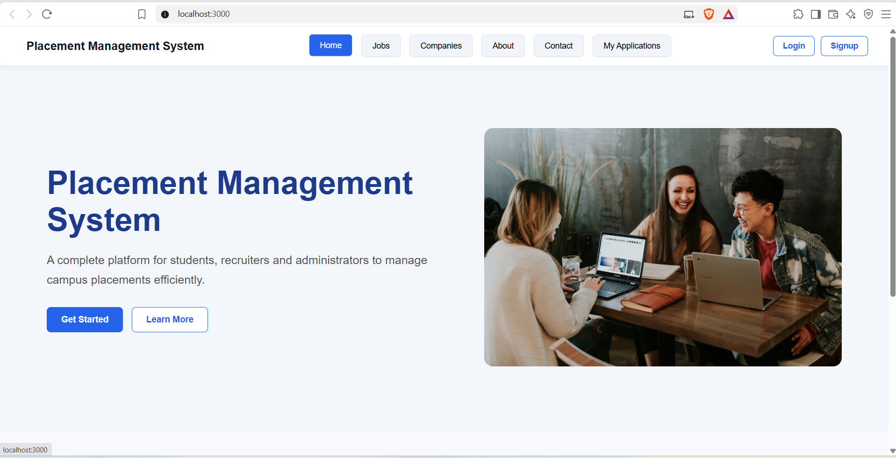
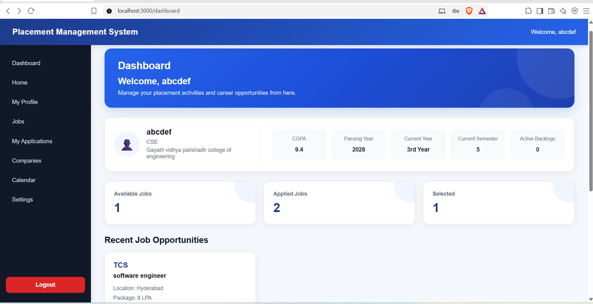
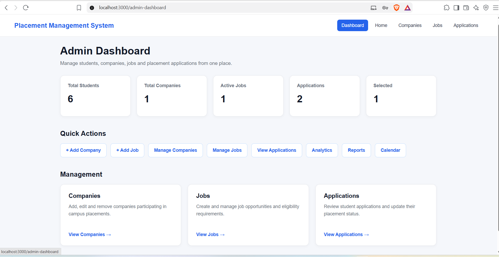

# Placement Management System

A full-stack MERN-based platform designed to manage student placement activities, job opportunities, applications, resumes, placement events, and administrative operations in one centralized system.

## 🚀 Features

### 👨‍🎓 Student Features

- Student registration and login
- JWT-based authentication using HTTP-only cookies
- Student profile creation and editing
- Academic information management
- Skills and social profile management
- Resume upload and management
- View and download resume
- Browse available job opportunities
- Search, filter, sort, and paginate jobs
- View detailed job information
- Job eligibility validation
- Apply for eligible jobs
- Track submitted applications
- Application status tracking
- Placement notifications
- Placement calendar and events
- Resume builder
- Resume analysis
- AI-assisted resume/job matching
- Placement resources

### 👨‍💼 Admin Features

- Secure admin authentication
- Admin dashboard
- Student placement statistics
- Company management
- Job management
- Application management
- Update application status
- Candidate eligibility management
- Placement analytics
- Reports
- Calendar and event management
- Notifications
- Dashboard statistics

## 🤖 AI Features

The project includes AI-assisted functionality for resumes and job matching.

The system can:

- Analyze resume content
- Extract and process resume text
- Split resume content into chunks
- Generate embeddings
- Perform similarity-based matching
- Compare resume information with job requirements
- Provide resume/job matching results

The project also contains a local LLM-based workflow for development and experimentation.
## Screenshots

### Home Page


### Student Dashboard


### Admin Dashboard


## 🛠️ Tech Stack

### Frontend

- React
- React Router
- Axios
- JavaScript
- HTML
- CSS

### Backend

- Node.js
- Express.js
- MongoDB
- Mongoose
- JWT
- bcrypt
- Multer

### AI

- OpenAI API integration
- Embeddings
- Vector similarity search
- Local LLM/embedding workflow

### Security

- HTTP-only cookies
- JWT authentication
- Role-based authorization
- Password hashing with bcrypt
- Helmet
- Rate limiting
- CORS configuration
- File upload validation
- Environment variables for sensitive configuration

### Development Tools

- Git
- GitHub
- VS Code
- Postman
- MongoDB Atlas

## 🏗️ System Architecture

```text
                    ┌─────────────────────┐
                    │      Student        │
                    └──────────┬──────────┘
                               │
                               ▼
                    ┌─────────────────────┐
                    │   React Frontend    │
                    └──────────┬──────────┘
                               │
                         REST API / Axios
                               │
                               ▼
                    ┌─────────────────────┐
                    │  Express / Node.js  │
                    │      Backend        │
                    └──────────┬──────────┘
                               │
                ┌──────────────┼──────────────┐
                ▼              ▼              ▼
        ┌─────────────┐ ┌─────────────┐ ┌─────────────┐
        │   MongoDB   │ │   Resume    │ │ AI / Vector │
        │   Database  │ │   Storage   │ │ Processing  │
        └─────────────┘ └─────────────┘ └─────────────┘
```

## 📂 Project Structure

```text
PlacementManagementSystem/
│
├── backend/
│   ├── Controllers/
│   ├── Middlewares/
│   ├── Models/
│   ├── Routes/
│   ├── Utils/
│   ├── config/
│   ├── app.js
│   ├── package.json
│   └── .gitignore
│
├── frontend/
│   ├── public/
│   ├── src/
│   │   ├── components/
│   │   ├── Pages/
│   │   ├── services/
│   │   ├── App.js
│   │   └── index.js
│   ├── package.json
│   └── .gitignore
│
├── .gitignore
├── package.json
└── README.md
```

## 🔐 Authentication & Security

The application implements several security mechanisms:

- JWT-based authentication
- HTTP-only authentication cookies
- Role-based access control
- Separate student and admin authorization
- Password hashing using bcrypt
- Authentication rate limiting
- Helmet security middleware
- CORS configuration
- Secure resume upload validation
- Maximum resume file-size restriction
- Environment variables for sensitive credentials

## 💼 Placement Workflow

The main placement workflow is:

```text
Student Registration
        ↓
Student Profile
        ↓
Resume Upload
        ↓
Browse Jobs
        ↓
Eligibility Verification
        ↓
Apply for Job
        ↓
Application Tracking
        ↓
Admin Reviews Application
        ↓
Application Status Update
        ↓
Student Notification
```

## 📊 Admin Workflow

```text
Admin Login
    ↓
Admin Dashboard
    ↓
Manage Companies
    ↓
Create / Manage Jobs
    ↓
View Applications
    ↓
Update Application Status
    ↓
View Analytics & Reports
    ↓
Manage Placement Events
```

## 📋 Job Management

Administrators can manage placement opportunities including:

- Company
- Job title
- Job description
- Location
- Package
- Minimum CGPA
- Eligible branches
- Required skills
- Application deadline

Students can search and filter available jobs and apply when they satisfy the defined eligibility requirements.

## 📄 Resume Management

Students can upload PDF resumes through the application.

The system validates uploaded files and stores resume metadata including:

- Filename
- File path
- Upload date

The resume can also be processed by the resume-analysis and matching functionality.

## 🧠 Resume & Job Matching

The AI workflow follows the general pipeline:

```text
Resume PDF
    ↓
Text Extraction
    ↓
Text Cleaning
    ↓
Chunking
    ↓
Embeddings
    ↓
Vector Similarity Search
    ↓
Relevant Resume Content
    ↓
Job Matching / AI Analysis
```

This allows the system to compare resume information with job requirements and provide matching results.

## 📈 Analytics

The admin dashboard provides placement-related statistics and analytics, including:

- Application statistics
- Application status distribution
- Placement information
- Package-related statistics
- Dashboard summaries

## 🗓️ Placement Calendar

The system includes calendar functionality for managing placement-related events.

Administrators can create and manage events, while students can view relevant placement activities.

## ⚙️ Installation

### Prerequisites

Make sure the following are installed:

- Node.js
- npm
- MongoDB Atlas account
- Git

### 1. Clone the repository

```bash
git clone https://github.com/SaiKarthikVeeravilli/PlacementManagementSystem.git
```

```bash
cd PlacementManagementSystem
```

### 2. Install backend dependencies

```bash
cd backend
npm install
```

### 3. Install frontend dependencies

Open another terminal:

```bash
cd frontend
npm install
```

### 4. Configure environment variables

Create a `.env` file inside the `backend` folder.

Example:

```env
PORT=4006
DB_LINK=your_mongodb_connection_string
SECRET=your_jwt_secret
FRONTEND_URL=http://localhost:3000
```

Add any additional API credentials required by the AI/email functionality to the environment configuration.

**Never commit `.env` files or API keys to GitHub.**

### 5. Start the backend

From the `backend` directory:

```bash
npm start
```

The backend runs on:

```text
http://localhost:4006
```

### 6. Start the frontend

From the `frontend` directory:

```bash
npm start
```

The frontend runs on:

```text
http://localhost:3000
```

## 🔗 API

The backend exposes REST APIs for:

- Authentication
- Student profiles
- Resumes
- Companies
- Jobs
- Applications
- Notifications
- Events
- Reports
- Analytics
- Resume analysis
- Job matching

The frontend communicates with the backend using Axios.

## 🧪 Testing

The application can be tested locally using:

- Browser
- Postman
- MongoDB Atlas
- React development server
- Node.js/Express server

Important scenarios include:

- Student registration/login
- Admin login
- Profile management
- Resume upload
- Job creation
- Job search and filtering
- Eligibility validation
- Job application
- Application status updates
- Notifications
- Resume analysis
- Admin analytics

## 🔒 Environment & Sensitive Data

Sensitive configuration is intentionally excluded from the repository.

The following should not be committed:

```text
.env
node_modules/
uploads/
```

API keys, database credentials, JWT secrets, email credentials, and other private configuration should always be stored using environment variables.

## 🚧 Future Deployment

The application is currently prepared for deployment.

Production deployment will include:

- Cloud-based backend hosting
- Cloud-based frontend hosting
- MongoDB Atlas
- Cloud-based resume/file storage
- Production AI/LLM configuration
- Production environment variables
- HTTPS and secure cookie configuration

## 🎯 Project Objective

The goal of the Placement Management System is to provide a centralized platform that simplifies placement-related activities for students and administrators.

Instead of managing student profiles, job opportunities, applications, resumes, notifications, events, and placement analytics through separate systems, the platform brings these activities together into a single web application.

## 👨‍💻 Author

**Sai Karthik Veeravilli**

B.Tech Student | Java & DSA | MERN Stack Developer

### Profiles

- GitHub: https://github.com/SaiKarthikVeeravilli
- LinkedIn: https://linkedin.com/in/s-t-sai-karthik-veeravavilli-0416123b/
- LeetCode: https://leetcode.com/u/Sai_Karthik_Veeravavilli/

## 📌 Project Status

🚧 **Active Development / Deployment Preparation**

The core Placement Management System functionality has been implemented. The project is currently being prepared for production deployment and final testing.
